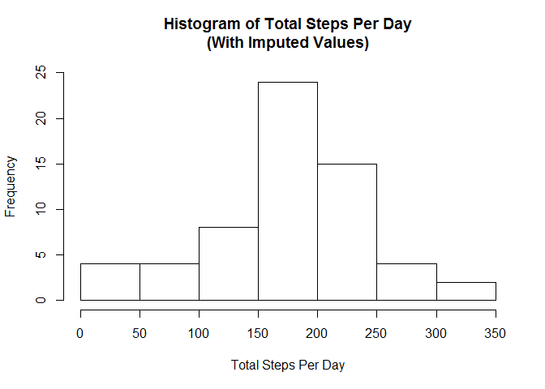

# Reproducible Research: Peer Assessment 1


## Loading and preprocessing the data

```r
library(plyr)
library(dplyr)

# Fork data files from https://github.com/rdpeng/RepData_PeerAssessment1
# unzip("activity.zip", exdir = "data")
act <- read.csv("data/activity.csv", header = T)
act$date <- as.Date(as.character(act$date), "%Y-%m-%d")
```


## What is mean total number of steps taken per day?


```r
# Calculate total days
totalDays <- length(unique(sort(act$date)))

# Calculate total steps per day
totalSteps <- aggregate(act[,1], list(act$date), sum)
totalStepPerDay <- totalSteps$x / totalDays

# Plot a histogram of the total steps taken per day
hist(totalStepPerDay, ylim = c(0, 20), main = "Histogram of Total Steps Per Day", xlab = "Total Steps Per Day")
```

<!-- -->

```r
# Calculate mean of the total steps taken per day
mean(totalStepPerDay, na.rm = T)
```

```
## [1] 176.4949
```

```r
# Calculate median of the total steps taken per day
median(totalStepPerDay, na.rm = T)
```

```
## [1] 176.4754
```


## What is the average daily activity pattern?


```r
# Calculate 5 minute interval means
byInterval <- group_by(act, interval)
intervalAv <- summarize(byInterval, intrvalMean=mean(steps, na.rm = T))

# Create time series of interval averages 
iaTS <- ts(intervalAv$intrvalMean)

# Plot time time series of interval averages
plot.ts(iaTS, main = "Daily 5 Minute Intervals", ylab = "Average Steps", type="l")
```

<!-- -->

```r
# Calculate interval w overall highest interval mean
avgMax <- which.max(intervalAv$intrvalMean)
intervalAv[avgMax,]
```

```
## # A tibble: 1 × 2
##   interval intrvalMean
##      <int>       <dbl>
## 1      835    206.1698
```

## Imputing missing values


```r
# Calculate total missing values in dataset
sum(is.na(act$steps))
```

```
## [1] 2304
```

```r
# Calculate mean steps per day
meanStepPerDay <- aggregate(act[,1], list(act$date), mean)
names(meanStepPerDay) <- c("date","mean.steps")

# Fill in missing daily mean calculations with mean over all days
meanStepPerDay$mean.steps[is.na(meanStepPerDay$mean.steps)] = mean(meanStepPerDay$mean.steps, na.rm = T)

# Add column with daily mean values to new activity data frame
act_imputed <- arrange(join(act,meanStepPerDay), date)
```

```
## Joining by: date
```

```r
# Fill NA step values with daily mean values
act_imputed$steps[is.na(act_imputed$steps)] = act_imputed$mean.steps

# Compute imputed total steps per day
totalSteps2 <- aggregate(act_imputed[,1], list(act_imputed$date), sum)
totalStepPerDay2 <- totalSteps2$x / totalDays

# Create histogram from data frame with imputed values
hist(totalStepPerDay2, ylim = c(0, 25), main = "Histogram of Total Steps Per Day\n(With Imputed Values)", xlab = "Total Steps Per Day")
```

<!-- -->

```r
# Calculate mean of the total steps taken per day
mean(totalStepPerDay2, na.rm = T)
```

```
## [1] 176.1525
```

```r
# Calculate median of the total steps taken per day
median(totalStepPerDay2, na.rm = T)
```

```
## [1] 180.5738
```

The introduction of imputed values raised the median value.  The median value was skewed in the original calculation by removing 0 values from the calculation.  The mean value remained fairly constant with higher total values in the 150 to 200 five minute interval periods, and overall less dispersion.

## Are there differences in activity patterns between weekdays and weekends?


```r
# Add column to describe measurement date as weekday or weekend
act_imputed$weekday <- weekdays(act_imputed$date)
act_imputed$weekday  <- ifelse(act_imputed$weekday %in% c("Sunday","Saturday"), "weekend", "weekday")

# Subset the weekend and weekday data
act_weekend <- filter(act_imputed, weekday == "weekend")
act_weekday <- filter(act_imputed, weekday == "weekday")

# Calculate 5 minute interval means on imputed weekday datasets
# By weekend: 
byInterval2 <- group_by(act_weekend, interval)
intervalAv2 <- summarize(byInterval2, intrvalMean=mean(steps, na.rm = T))
# By weekday:
byInterval3 <- group_by(act_weekday, interval)
intervalAv3 <- summarize(byInterval3, intrvalMean=mean(steps, na.rm = T))

# Create time series of 5 minute interval averages 
iaTS2 <- ts(intervalAv2$intrvalMean)
iaTS3 <- ts(intervalAv3$intrvalMean)

# Panel plot w 2 row, 1 column
par(mfrow = c(2,1), mar = c(4,4,2,1))

# Plot time time series of interval averages
plot.ts(iaTS2, type="l", main = "Weekend", ylab = "No. of Steps")
plot.ts(iaTS3, type="l", main = "Weekday", ylab = "No. of Steps")
```

<!-- -->


Weekend activity levels were overall higher.  Weekday activity levels showed a more pronounced spike in the approximate 110 minute interval period.


