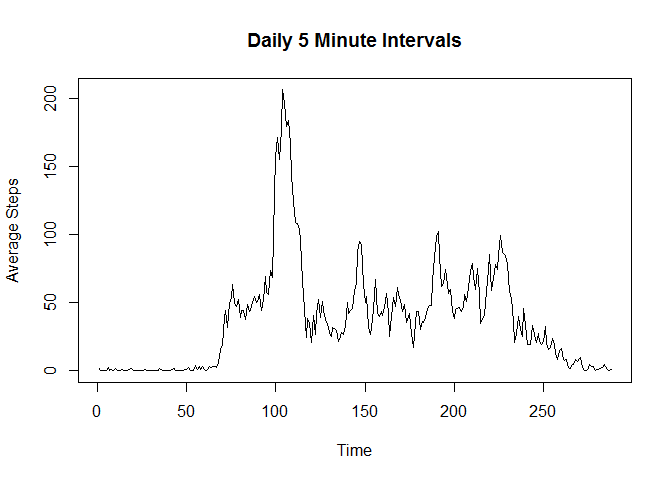

# Reproducible Research: Peer Assessment 1


## Loading and preprocessing the data

```r
library(plyr)
library(dplyr)

# Fork data files from https://github.com/rdpeng/RepData_PeerAssessment1
# unzip("activity.zip", exdir = "data")
act <- read.csv("data/activity.csv", header = T)
act$date <- as.Date(as.character(act$date), "%Y-%m-%d")
```


## What is mean total number of steps taken per day?


```r
# Calculate total steps per day
totalStepPerDay <- aggregate(act[,1], list(act$date), sum)
names(totalStepPerDay) <- c("date", "total.steps")

# Plot a histogram of the total steps taken per day
hist(totalStepPerDay$total.steps, xlab = "Total Steps Per Day")
```

<!-- -->

```r
# Calculate mean of the total steps taken per day
mean(totalStepPerDay$total.steps, na.rm = T)
```

```
## [1] 10766.19
```

```r
# Calculate median of the total steps taken per day
median(totalStepPerDay$total.steps, na.rm = T)
```

```
## [1] 10765
```


## What is the average daily activity pattern?


```r
# Calculate 5 minute interval means
byInterval <- group_by(act, interval)
intervalAv <- summarize(byInterval, intrvalMean=mean(steps, na.rm = T))

# Create time series of interval averages 
iaTS <- ts(intervalAv$intrvalMean)

# Plot time time series of interval averages
plot.ts(iaTS, type="l")
```

<!-- -->

```r
# Calculate interval w overall highest interval mean
avgMax <- which.max(intervalAv$intrvalMean)
intervalAv[avgMax,]
```

```
## # A tibble: 1 × 2
##   interval intrvalMean
##      <int>       <dbl>
## 1      835    206.1698
```

## Imputing missing values


```r
# Calculate total missing values in dataset
sum(is.na(act$steps))
```

```
## [1] 2304
```

```r
# Calculate mean steps per day
meanStepPerDay <- aggregate(act[,1], list(act$date), mean)
names(meanStepPerDay) <- c("date","mean.steps")

# Fill in missing daily mean calculations with mean over all days
meanStepPerDay$mean.steps[is.na(meanStepPerDay$mean.steps)] = mean(meanStepPerDay$mean.steps, na.rm = T)

# Add column with daily mean values to new activity data frame
act_imputed <- arrange(join(act,meanStepPerDay), date)
```

```
## Joining by: date
```

```r
# Fill NA step values with daily mean values
act_imputed$steps[is.na(act_imputed$steps)] = act_imputed$mean.steps
```

```
## Warning in act_imputed$steps[is.na(act_imputed$steps)] = act_imputed
## $mean.steps: number of items to replace is not a multiple of replacement
## length
```

```r
totalStepPerDay2 <- aggregate(act_imputed[,1], list(act_imputed$date), sum)
names(totalStepPerDay2) <- c("date", "total.steps")

# Create histogram from data frame with imputed values
hist(totalStepPerDay2$total.steps)
```

<!-- -->

```r
# Calculate mean of the total steps taken per day
mean(totalStepPerDay2$total.steps, na.rm = T)
```

```
## [1] 10745.3
```

```r
# Calculate median of the total steps taken per day
median(totalStepPerDay2$total.steps, na.rm = T)
```

```
## [1] 11015
```

## Are there differences in activity patterns between weekdays and weekends?


```r
# Add column to describe measurement date as weekday or weekend
act_imputed$weekday <- weekdays(act_imputed$date)
act_imputed$weekday  <- ifelse(act_imputed$weekday %in% c("Sunday","Saturday"), "weekend", "weekday")

# Subset the weekend data
act_weekend <- filter(act_imputed, weekday == "weekend")

# Calculate 5 minute interval means on imputed dataset
byInterval2 <- group_by(act_weekend, interval)
intervalAv2 <- summarize(byInterval2, intrvalMean=mean(steps, na.rm = T))

# Create time series of 5 minute interval averages 
iaTS2 <- ts(intervalAv2$intrvalMean)

# Plot time time series of interval averages
plot.ts(iaTS2, type="l")
```

<!-- -->
